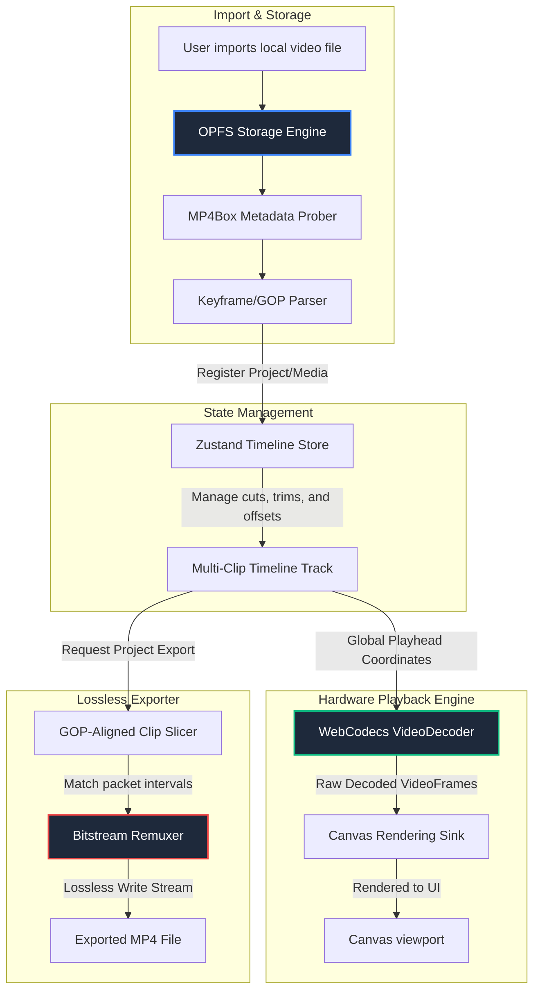

# Fast Video Cut: High-Performance In-Browser Non-Linear Video Editor (NLE)

[](https://www.typescriptlang.org/)
[](https://react.dev/)
[](https://vitejs.dev/)
[](https://github.com/pmndrs/zustand)
[](https://tanstack.com/router)

Fast Video Cut is a desktop-class, client-side, zero-install **Non-Linear Video Editor (NLE)** built directly on modern Web APIs. Unlike traditional web-based video editors that rely on heavy cloud transcoding servers or sluggish CPU-bound WebAssembly decoders, Fast Video Cut uses **hardware-accelerated WebCodecs** for real-time decoding on the GPU and performs **lossless stream copying** for instant exports with zero quality degradation.

---

## 🏗️ Architectural Overview

Fast Video Cut shifts the entire media processing stack into the browser. Below is a high-level visualization of how media flows from initial import to timeline manipulation, real-time rendering, and lossless export.



---

## 🛠️ Core Engine Components

### 1. GPU-Accelerated Playback Engine (`src/media/player.ts`)

- **WebCodecs Integration:** Utilizes the native browser `VideoDecoder` to hand over compressed video bitstreams directly to the local GPU hardware decoder, yielding smooth 60fps canvas updates.
- **Sequential Seek Queue:** Orchestrates a clean decoding loop using asynchronous generators. Whenever a seek or playhead transition occurs, it aborts pending decode actions and explicitly calls `iterator.return()` to prevent hardware decoder lockouts.
- **Resource Lifecycle:** Directly manages memory by calling `.close()` on all `VideoFrame` instances immediately after copying to the canvas, preventing browser memory leaks and VRAM exhaustion.

### 2. Lossless GOP-Aligned Exporter (`src/media/exporter.ts`)

- **Zero-Copy Remuxing:** Instead of fully decoding and re-encoding video frames (which causes quality loss and takes minutes), the exporter slices video on keyframe (GOP - Group of Pictures) boundaries and copies compressed bitstream packets directly from the source to the output MP4 container.
- **Ultra-Fast Speeds:** Export operations are CPU-light and complete in seconds, capped purely by the client machine's disk read/write capability.

### 3. High-Throughput I/O Engine

- **Origin Private File System (OPFS):** Implements client-side workspace persistence using the new OPFS API. This allows Fast Video Cut to stream massive video files directly from local storage via low-latency byte offsets, bypassing standard browser heap allocation ceilings and tab crashes.

### 4. Non-Linear Timeline & State Coordinator (`src/store/edit-store.ts`)

- **Global Timeline Projection:** Tracks multiple clips, cut indices, ripple trims, and active playback segments in a single Zustand store. Maps the virtual playhead dynamically across multi-clip timelines for continuous playback.
- **Type-Safe Routing:** Configures **TanStack Router** file-system routing to clean up view transitions, managing navigation between project setups and active project editing.

---

## 📂 Codebase Directory Structure

```bash
fast-lossless-cut/
├── tsr.config.json           # TanStack Router configuration
├── vite.config.ts            # Vite build and plugin system
├── src/
│   ├── App.tsx               # Router provider initialization
│   ├── index.css             # Core design tokens and tailwind utilities
│   ├── route/                # File-system router pages (__root, index, editor)
│   ├── store/                # Global states (Timeline edits, shortcuts, projects)
│   │   ├── edit-store.ts     # Core NLE timeline state & undo/redo stacks
│   │   └── project-store.ts  # OPFS workspace directories & loaders
│   ├── media/                # Low-level media parsing and codecs
│   │   ├── player.ts         # WebCodecs decoder loop & canvas paint engine
│   │   ├── exporter.ts       # Lossless bitstream remuxer & exporter
│   │   ├── probe.ts          # Metadata, tracks, and demuxing profiles
│   │   └── keyframes.ts      # GOP boundaries and keyframe indices lookup
│   ├── components/           # UI and editor views
│   │   ├── editor/           # Player controls, media bins, export panels
│   │   ├── timeline/         # Zoomable tracks, clip segments, interactive playheads
│   │   └── ui/               # Standard primitives (buttons, modals, dialogs)
│   └── keymap/               # Short-cut handlers and listener bindings
```

---

## 🚀 Getting Started

### Prerequisites

Make sure you have [Node.js](https://nodejs.org/) installed (v18+ recommended) and `npm` or `bun`.

### Installation

1. Clone the repository and navigate to the project directory:

   ```bash
   git clone https://github.com/your-username/fast-lossless-cut.git
   cd fast-lossless-cut
   ```

2. Install dependencies:

   ```bash
   npm install
   ```

3. Run the routing generator (TanStack Router CLI):

   ```bash
   npx @tanstack/router-cli generate
   ```

4. Start the local development server:

   ```bash
   npm run dev
   ```

5. Build the application for production:
   ```bash
   npm run build
   ```

---

## 🔒 Security & Privacy

Fast Video Cut is **100% serverless and offline-first**. All video files are stored and processed inside the client's secure Origin Private File System browser sandbox. No telemetry, raw video data, or metadata is ever uploaded to a remote server.
